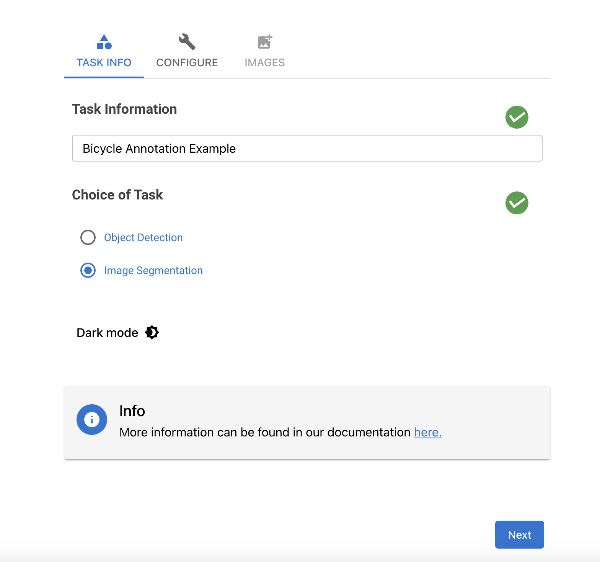
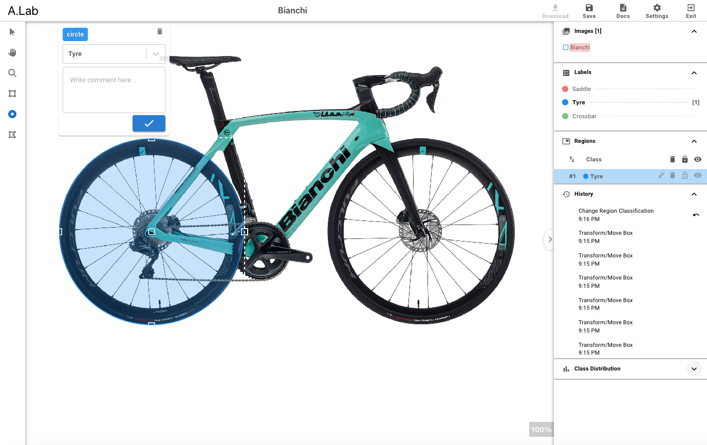
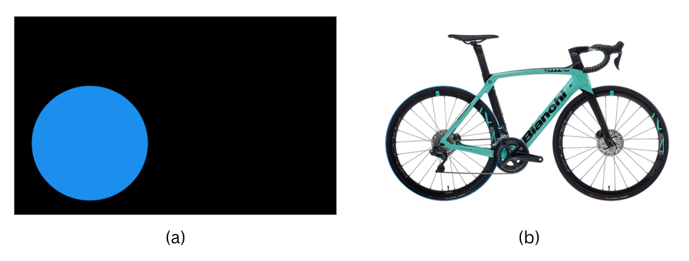
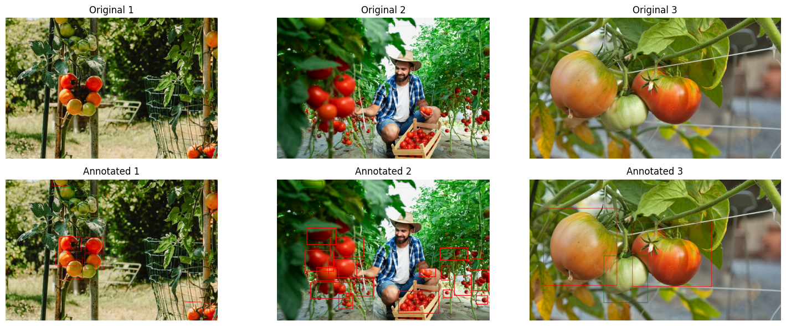

# Summary

Annotate-Lab is an open-source image annotation tool designed to enhance the efficiency and accuracy of the annotation process through a client-server architecture. The application consists of a React-based client that offers an intuitive user interface for performing annotations, and a Flask-based server that manages the storage and generation of annotated images and configuration settings. This robust combination makes Annotate-Lab a versatile solution for various fields requiring precise image labeling, such as machine learning, medical imaging, and autonomous driving.

# Statement of need

Image annotation is a critical task in various fields, including machine learning, computer vision [@ojha_image_2017], medical imaging [@aljabri_towards_2022], and autonomous driving [@liu_survey_2024]. Annotating images involves labeling specific elements within an image, a process crucial for training algorithms to recognize and interpret visual data. Given the growing reliance on annotated datasets for accurate model training, there's a significant need for efficient, user-friendly, and customizable annotation tools. Traditional methods often involve manual processes that are time-consuming and prone to errors, highlighting the necessity for automated and semi-automated solutions that enhance accuracy and efficiency.

# Related Software

Several image annotation tools are available, each catering to different aspects of the annotation process. Some of the notable ones include:

1. **[Label Studio](https://github.com/HumanSignal/label-studio)**: A graphical image annotation tool that is easy to use and supports various annotation formats. It's popular for creating bounding boxes for object detection tasks.

2. **[VGG Image Annotator (VIA)](https://www.robots.ox.ac.uk/~vgg/software/via/)**: A lightweight and standalone application for image, audio, and video annotation [@dutta_via_2019]. It is browser-based and does not require installation.

3. **[COCO Annotator](https://github.com/jsbroks/coco-annotator)**: An open-source web-based image annotation tool that supports the COCO format. It provides functionalities for bounding boxes, segmentation masks, and keypoints.

4. **[SuperAnnotate](https://www.superannotate.com/)**: A more advanced and collaborative platform that offers tools for annotating images and videos, focusing on high-quality output for complex tasks.


5. **[CVAT (Computer Vision Annotation Tool)](https://github.com/cvat-ai/cvat)**: An open-source tool designed for the annotation of images and videos, providing a robust set of features for different types of annotations such as bounding boxes, polylines, and segmentation [@cvat_ai_corporation_computer_2024].

# Application Overview

**Annotate-Lab** is an open-source image annotation application designed to streamline the annotation process through a client-server architecture. The application comprises two main components:

1. **Client (React Application)**:
   - **Functionality**: The client component provides the user interface where users interact with the application to perform annotations. The interface is designed to be intuitive, allowing users to efficiently label images with various annotation tools.
   - **Features**: It includes tools for drawing bounding boxes, segmentation masks, and other annotation types. Users can also configure settings to tailor the annotation process to specific needs.

2. **Server (Flask Application)**:
   - **Functionality**: The server component handles the backend processes, including persisting annotated changes and generating masked and annotated images. It ensures that all annotations are stored securely and can be retrieved or modified as needed.
   - **Features**: The server also manages configuration settings, enabling customization of the annotation process to suit different project requirements. It supports the generation of various output formats necessary for training machine learning models.

**Annotate-Lab** aims to provide a comprehensive solution for image annotation, combining ease of use with powerful features to support a wide range of applications. Its open-source nature allows for community contributions and customizability, making it a versatile tool for both academic and commercial purposes.

# Example: Annotating a Bicycle

This example guides users through the process of annotating a bicycle and reviewing the results. The process begins with reviewing task details in the "Task Info" tab to understand the objectives for segmenting the annotated image. In the "Configuration" tab, users set up annotation tools and label names to prepare for annotation. Following setup, users upload images to be annotated in the "Image" tab to initiate the annotation process. \autoref{fig:configuration_setup} shows the tabs.




 During annotation, users select tools such as the circle tool to highlight specific areas of interest on the bicycle, labeling each region and adding contextual comments as needed. \autoref{fig:annotation_example} shows the annotation of tyre in bicycle.
 
 

 Once annotations are complete, users save their work to preserve changes. Finally, users can download configuration settings, annotated images, or masked images using the download button based on their requirements. The annoted and masked images are shown in \autoref{fig:masked_output}.



The downloaded configurations provides the regions information along with co-ordinates, class and comments. The downloaded configuration of above annotation is shown below. 
```json
{
   "configuration":[
      {
         "image-name":"bianchi.jpeg",
         "regions":[
            {
               "region-id":"06503829808876826",
               "image-src":"http://127.0.0.1:5000/uploads/bianchi.jpeg",
               "class":"Tyre",
               "comment":"Back Tyre",
               "tags":"",
               "rx":[
                  0.05432613622740995
               ],
               "ry":[
                  0.350004519235816
               ],
               "rw":[
                  0.3601621878393051
               ],
               "rh":[
                  0.5781758957654723
               ]
            }
         ],
         "color-map":{
            "Tyre":[
               244,
               67,
               54
            ]
         }
      }
   ]
}
```
This tool also supports the [YOLO format](https://docs.ultralytics.com/datasets/detect/#ultralytics-yolo-format). A dataset of ripe and unripe tomatoes has been created and can be found on [Kaggle](https://www.kaggle.com/datasets/sumn2u/riped-and-unriped-tomato-dataset). \autoref{fig:annotated_tomatoes} shows the original and annotated tomatoes from that dataset. Besides this, it also selects the bounding box using the Segment Anything Model (SAM) [@kirillov_segment_2023].




# Conclusion

Annotate-Lab stands out as a robust and user-friendly open-source solution for image annotation. By leveraging a client-server architecture, it effectively separates the user interface from backend processes, ensuring a smooth and efficient annotation workflow. The React-based client provides an intuitive interface for performing annotations, while the Flask-based server handles data persistence, configuration, and the generation of annotated images. This comprehensive approach makes Annotate-Lab a valuable tool for various applications, including machine learning, computer vision, and medical imaging, among others. Its open-source nature also encourages community contributions and customization, enhancing its potential for widespread adoption.

# Acknowledgements

We thank the developers and contributors of Annotate-Lab for their dedication and hard work. We also acknowledge idapgroup's [`react-image-annotate`](https://github.com/idapgroup/react-image-annotate) package and Ghahramanpour's [`image_annotator`](https://github.com/gnamiro/image_annotator/tree/master) project, whose work has been instrumental in the development of this application.

# References